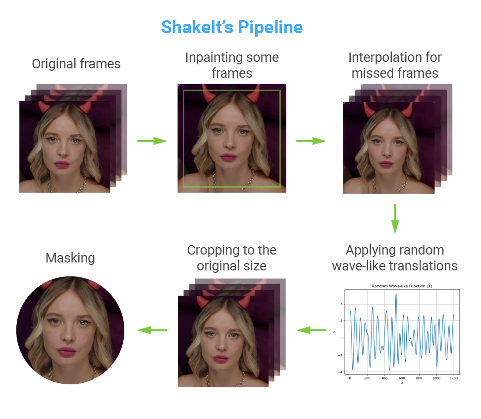
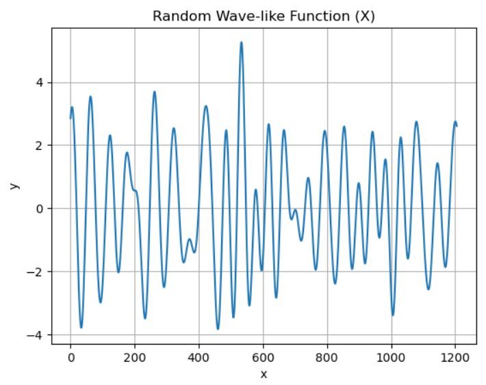

# ShakeIt

Welcome to the Camera Shake Effect Generator - ShakeIt repository! This project provides an algorithm for adding a realistic camera shake effect to square videos, simulating the natural movement and instability that occurs when capturing selfie videos from a handheld camera. Whether creating social media content or adding an authentic touch to your videos, this tool is designed to give your footage a lively and engaging feel.

## Features

- Realistic Camera Shake: Our algorithm applies natural camera movements, replicating the motion experienced during handheld recording, resulting in a genuine and immersive effect.
- Inpainting Model: The integrated inpainting model intelligently removes black borders that may arise due to the camera shake effect, providing polished and professional-looking videos.



## Prerequisites
- Linux (We tested our codes on Ubuntu 18.04.6)
- Anaconda
- Python 3.11
- Pytorch 2.0.1

To get started, first, please clone the repo.

```
git clone https://github.com/vv4alekseev/ShakeIt
```

Then, please run the following commands:

```
conda create -n shakeit python=3.11
conda activate shakeit
pip install -r requirements.txt
```

## Quick start

1. Download the pre-trained model and the data. [Link](https://drive.google.com/file/d/1COL7sKcJT3WRU4tic-3S5xsiu1KGg3Qc/view?usp=sharing)
2. Put the downloaded zip files into the root directory of this project.
```
unzip shakeit.zip
```
3. Run the shaking effect demo.

```
python3 apply_camera_shake.py --input_video demo/01.mp4  --output_video results/01_shaked.mp4
```

You will find a `01_shaked.mp4` file in `results` if everything works. And the video should be like this:

https://github.com/vv4alekseev/ShakeIt/assets/57874123/8454dbff-a2cf-4905-988e-8617909c1923

## Research Process: Exploring Video Inpainting, Simulating Shaking Effects, and Creating Smooth Translations

### Video Inpainting Techniques

In the first phase of my research, I evaluated the effectiveness of various video inpainting techniques for intelligently adding context-aware extra borders. With the successful integration of the inpainting model, the algorithm intelligently removed black borders that might occur during the simulated shaking process, resulting in polished and professional-looking videos. By analyzing research papers and algorithms, I identified the optimal inpainting model for removing the black borders caused by the simulated camera shake effect. I am utilizing [DeepFill-v2](https://github.com/nipponjo/deepfillv2-pytorch) for some video frames and then applying linear interpolation between the missing frames. This allows you to expedite the process of repainting by an order of magnitude.

### Simulating Realistic Shaking Effects

Recording numerous selfie videos allowed me to gain invaluable insights into the dynamics of camera movements caused by natural hand shaking. By replicating and studying these real-world motions, I gained a deeper understanding of the jitter and movements essential for creating a realistic shaking effect. The amplitude of vertical movements is greater than that of horizontal movements.

### Creating Smooth Translations with Wave-Form Function
After implementing the camera shake effect, I sought to enhance its realism by introducing smooth translations along the x and y axes. To achieve this, I developed a waveform function that gracefully modulates the camera's movements. This wave-form function adds fluidity to the camera shake effect, making it more organic and seamless, akin to natural hand motions during recording.



### Improving Results: Introducing Motion Blur

Explore motion blur to add a dynamic sense of speed and movement to the camera shake effect. By calculating motion degrees along the x and y axes, we can generate tailored blur kernels for each frame, creating realistic motion blur. The provided `backlog.py` code offers a foundation for implementing this enhancement. Users can experiment with motion intensity by incorporating motion blur and customizing the experience to their creative goals. This feature adds authenticity and excitement to the videos, captivating viewers and immersing them in the content.

### Conclusion:
The research process has been an enriching and iterative journey, combining insights from video inpainting techniques, extensive self-recorded experiments, and the development of the waveform function. The result is the Camera Shake Effect Generator - ShakeIt, an advanced tool that empowers users to create captivating and authentic selfie videos with dynamic and smooth camera shake effects.

## License

This open-source project is available under the [MIT License](https://opensource.org/license/mit/). Feel free to use, modify, and distribute the code according to the license terms.

## Contact

If you have any questions, please get in touch with me via

- [vv4alekseev@gmail.com](mailto:vv4alekseev@gmail.com)

## Acknowledgement

Some parts of this repo are based on [DeepFillv2-pytorch](https://github.com/nipponjo/deepfillv2-pytorch).
